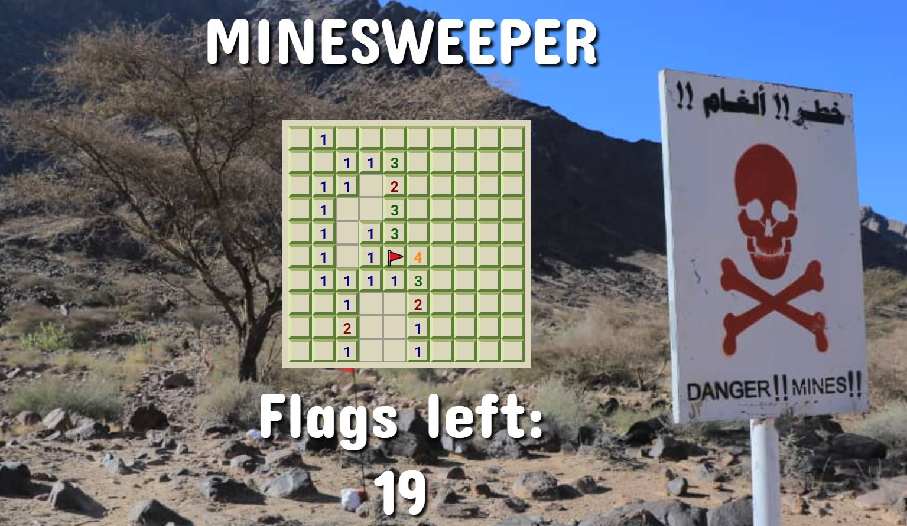

# Minesweeper Game

This is a simple Minesweeper game implemented in HTML, CSS, and JavaScript.

## How to Play

- Left-click on a square to reveal it. If it's a bomb, the game ends.
- Right-click on a square to place a flag. Flags can be used to mark potential bomb locations.
- The numbers displayed on squares indicate how many bombs are adjacent to that square.
- The game is won when all non-bomb squares are revealed and all bombs are flagged.

## Screenshots

## Technologies Used

- HTML
- CSS
- JavaScript

## How to Run

1. Clone this repository.
2. Open `index.html` in your web browser.

